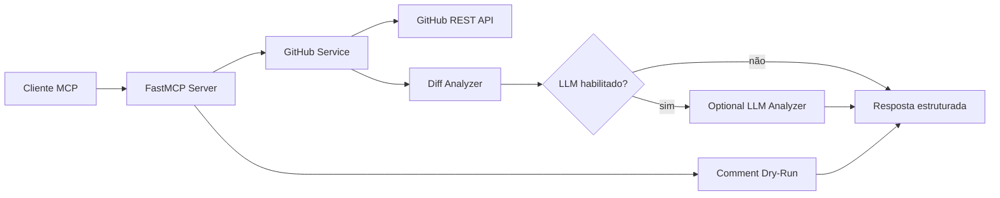

# mcp-github-pr-reviewer

MCP Server em Python para análise de Pull Requests no GitHub.

O projeto permite que um agente conectado via Model Context Protocol consulte
PRs, leia arquivos alterados, identifique riscos, gere revisão técnica em
Markdown e, com proteção explícita, prepare ou publique comentários no PR.

## Por Que Existe

Revisões de PR exigem contexto, atenção a risco e bons testes. Este servidor
organiza os dados do GitHub e entrega uma análise inicial consistente para apoiar
o engenheiro durante a revisão.

Por padrão, a análise é determinística e não depende de LLM. Uma análise LLM
opcional pode ser habilitada para complementar o review com um provedor
OpenAI-compatible.

## Tools

```txt
list_open_pull_requests
get_pull_request_summary
get_pull_request_files
get_pull_request_diff
analyze_pull_request
suggest_unit_tests
generate_markdown_review
comment_on_pull_request
```

## Arquitetura



Veja [docs/architecture.md](docs/architecture.md).

## Requisitos

- Python 3.12+
- Token GitHub com permissão mínima de leitura
- Token GitHub com permissão de comentário apenas se ações de escrita forem habilitadas

## Configuração

Copie `.env.example` para `.env` e configure:

```txt
GITHUB_TOKEN=ghp_replace_with_a_readonly_token
ALLOWED_REPOSITORIES=Cosmess/mcp-github-pr-reviewer
```

`ALLOWED_REPOSITORIES` é opcional. Quando preenchido, apenas os repositórios
listados podem ser consultados.

## LLM Opcional

Para complementar a análise heurística com um provedor OpenAI-compatible:

```txt
LLM_ANALYZER_ENABLED=true
LLM_API_KEY=replace_with_provider_key
LLM_API_BASE_URL=https://api.openai.com/v1
LLM_MODEL=gpt-4.1-mini
```

Quando habilitado, `analyze_pull_request` e `generate_markdown_review` adicionam
uma seção `Análise LLM opcional` ao Markdown.

Para repositórios privados, só habilite isso quando for permitido enviar patches
e metadados do PR para o provedor configurado.

## Comentário Com Dry-Run

`comment_on_pull_request` usa `dry_run=true` por padrão. Nesse modo, a tool não
publica nada no GitHub; ela apenas retorna o comentário que seria enviado.

Para comentar de verdade, três condições precisam ser atendidas:

```txt
ENABLE_GITHUB_WRITE_ACTIONS=true
dry_run=false
confirm=true
```

Isso evita que um agente publique comentários por acidente.

## Desenvolvimento

```bash
python -m venv .venv
.venv\Scripts\activate
pip install -e ".[dev]"
pytest
ruff check .
```

## Execução

```bash
mcp-github-pr-reviewer
```

## Docker

```bash
docker compose build
docker compose run --rm mcp-github-pr-reviewer
```

## Exemplos

- [Claude Desktop](examples/claude-desktop-config.json)
- [Cursor](examples/cursor-config.json)
- [Codex](examples/codex-config.md)
- [Sample PR analysis](examples/sample-pr-analysis.md)

## Segurança

- Repositórios podem ser restringidos por allowlist.
- Patches grandes são truncados por `MAX_PATCH_CHARS`.
- Contexto enviado ao LLM é limitado por `LLM_MAX_PATCH_CHARS`.
- Secrets não devem ser enviados em logs ou respostas.
- Escrita no GitHub é desabilitada por padrão.
- Comentário real exige flag de ambiente e confirmação explícita.

Veja [docs/security.md](docs/security.md).

## Documentação

- [Uso](docs/usage.md)
- [Arquitetura](docs/architecture.md)
- [Segurança](docs/security.md)
- [Roadmap](docs/roadmap.md)
