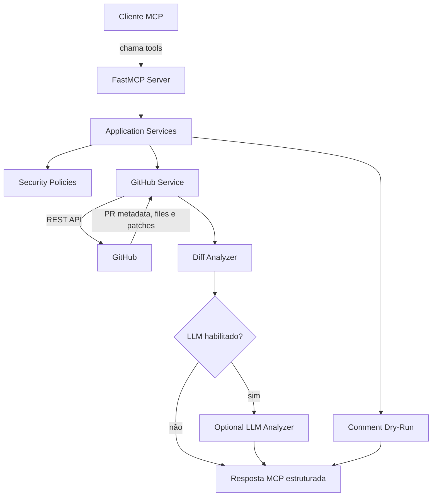

# Arquitetura

## Visão Geral

`mcp-github-pr-reviewer` é um MCP Server que expõe recursos de revisão de Pull
Requests do GitHub para clientes MCP.



Fluxo principal:

```txt
Cliente MCP
   |
   | chama tools
   v
FastMCP Server
   |
   | delega
   v
Application Services
   |
   | validam políticas e chamam GitHub
   v
GitHub REST API
   |
   | retorna metadados e arquivos do PR
   v
Diff Analyzer
   |
   | gera análise determinística
   v
Optional LLM Analyzer
   |
   | adiciona seção de análise LLM quando habilitado
   v
Resposta MCP estruturada
```

## Camadas

### Camada MCP

Arquivo: `src/mcp_github_pr_reviewer/server.py`.

Responsabilidades:

- Registrar tools MCP.
- Receber entrada do cliente MCP.
- Delegar trabalho para os services.
- Retornar respostas compatíveis com JSON/Markdown.

### Camada De Configuração

Arquivo: `src/mcp_github_pr_reviewer/config.py`.

Responsabilidades:

- Ler variáveis de ambiente.
- Definir timeout da API e limites de patch.
- Montar allowlist de repositórios.
- Configurar análise LLM opcional.
- Manter ações de escrita no GitHub desabilitadas por padrão.

### Camada De Segurança

Arquivo: `src/mcp_github_pr_reviewer/security/policies.py`.

Responsabilidades:

- Validar acesso ao repositório.
- Truncar patches grandes.
- Bloquear ações de escrita quando não estiverem habilitadas e confirmadas.

### Camada GitHub Service

Arquivo: `src/mcp_github_pr_reviewer/services/github_service.py`.

Responsabilidades:

- Chamar a GitHub REST API.
- Mapear payloads da API para modelos internos.
- Tratar paginação e metadados de rate limit.
- Normalizar erros da API.
- Executar dry-run de comentários sem chamar endpoints de escrita.
- Publicar comentários somente quando a escrita estiver habilitada e confirmada.

### Camada De Análise

Arquivo: `src/mcp_github_pr_reviewer/services/diff_analyzer.py`.

Responsabilidades:

- Identificar arquivos importantes.
- Detectar riscos comuns.
- Sugerir testes.
- Gerar revisão em Markdown.

A análise base é determinística e não depende de LLM. Isso mantém os testes
estáveis e deixa o comportamento fácil de revisar.

### Analisador LLM Opcional

Arquivo: `src/mcp_github_pr_reviewer/services/llm_service.py`.

Responsabilidades:

- Chamar um endpoint OpenAI-compatible de chat completions.
- Limitar o contexto de patch enviado ao provedor.
- Adicionar uma seção separada ao Markdown gerado pela análise determinística.
- Permanecer desabilitado até que `LLM_ANALYZER_ENABLED=true` e `LLM_API_KEY`
  estejam configurados.

O LLM complementa a revisão heurística. Ele não substitui a análise local.
